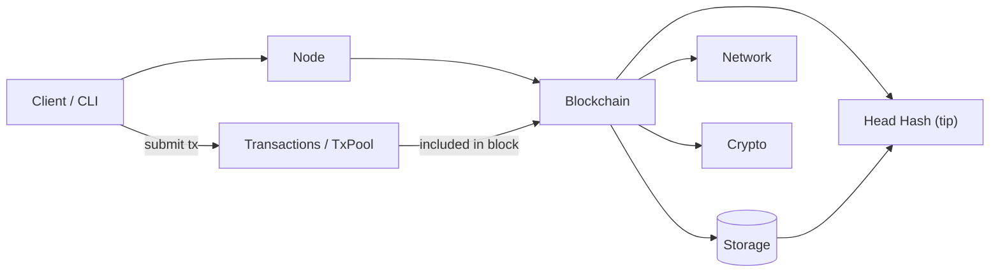
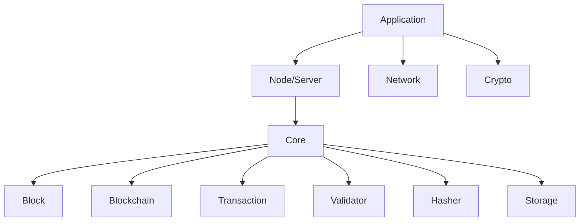

# Blockchain in Golang

## Architecture

## Code flow (short)

- **Start:** `main.go` boots the node/server (`network/server.go`).
- **Submit tx:** client → TxPool (`core/transaction.go`).
- **Create block:** node collects txs → `core/block.go`.
- **Validate:** `core/validator.go` checks block/tx rules.
- **Hashing:** `core/hasher.go` computes header/hash.
- **Add to chain:** `core/blockchain.go` appends block and updates head/tip.
- **Persist:** `core/storage.go` stores headers/blocks and head hash.
- **Network:** peers exchange headers/blocks (`network/transport.go`).

## Component Hierarchy

