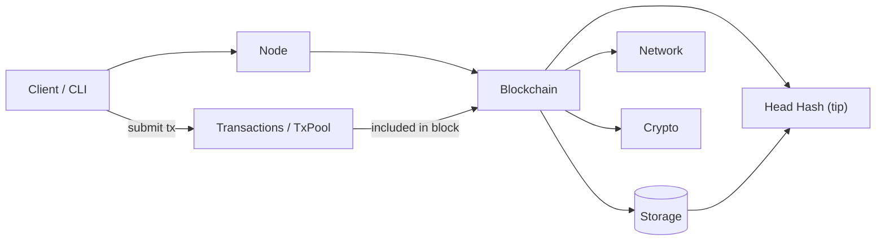

# Blockchain in Golang

## Architecture

```mermaid
flowchart LR
	Client[Client / CLI] --> Node[Node]
	Client -->|submit tx| TxPool[Transactions / TxPool]
	Node --> Blockchain[Blockchain]
	TxPool -->|included in block| Blockchain
	Blockchain --> Storage[(Storage)]
	Blockchain --> Network[Network]
	Blockchain --> Crypto[Crypto]
	Blockchain --> HeadHash["Head Hash (tip)"]
	Storage --> HeadHash
```
